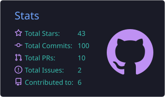
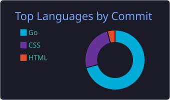

<!-- assets/ 目录下的素材由 .github/workflows/profile.yml 每日自动更新 -->

  

  <a href="./README.md">English</a> | <b>简体中文</b>

  

  
  

## 💫 关于我

- 🧑‍💻 **后端工程师**,拥有 **6 年**开发经验
- ⚙️ 擅长 **Go**、**Java**、**Python**、**Rust** · **Spring / Spring Boot** · **MySQL**
- 🤖 **AI Agent 探索者** — 热衷于折腾大模型与智能体
- 🌏 对**各种技术**都充满兴趣,持续学习新东西
- 🌱 希望我们能**一起成长**

## 🧠 技术栈

  

## 🌍 联系方式

<!-- TODO: 把下面的 "#" 换成你的真实链接 -->

  
  
  
  

## 📊 GitHub 数据

  
  

  
  

## 🏆 GitHub 奖杯

  

## 🐍 贡献贪吃蛇

  <picture>
    <source media="(prefers-color-scheme: dark)" srcset="https://raw.githubusercontent.com/yusanwen-code/yusanwen-code/output/github-contribution-grid-snake-dark.svg" />
    <source media="(prefers-color-scheme: light)" srcset="https://raw.githubusercontent.com/yusanwen-code/yusanwen-code/output/github-contribution-grid-snake.svg" />
    
  </picture>

  

